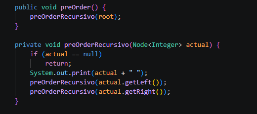
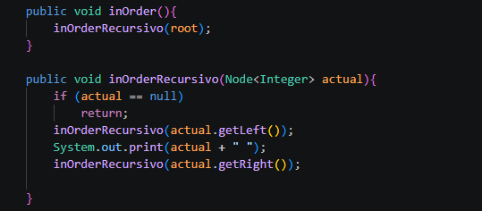
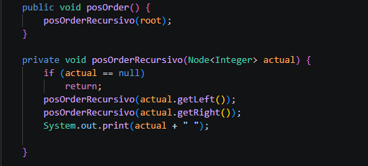
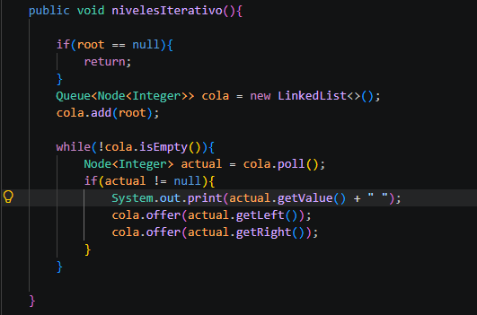
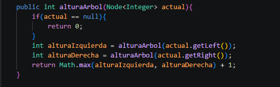
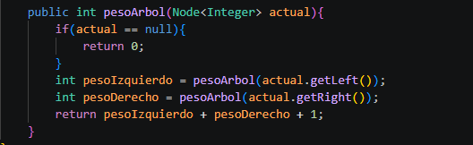
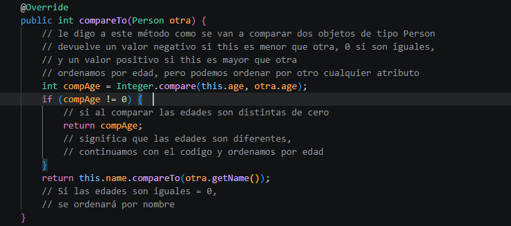

# Práctica: [Estructuras No Lineales - Árboles(Pre-Order, In-Order, Pos-Order)]

## Datos del Estudiante
- **Nombre:** [Nataly jiménez Salazar]
- **Curso:** [Grupo - 6 - Computación]
- **Fecha:** [2026 - 06 - 17]

---

## 1. [Estructuras No Lineales: Pre-Order, In-Order, Pos-Order y Cálculo Altura del árbol]
**Fecha:** 2026-06-16

**Descripción:** [Métodos de recorrido, arboles binarios: pre order, in order, pos order y calculo de la altura del árbol]

***Bloque de Código: Pre-Order***

***Bloque de Código: IN-Order***

***Bloque de Código: POS-Order***

***Bloque de Código: Recorrido por Niveles o Anchura***

***Bloque de Código: Cálculo Altura del Árbol***

---

## 2. [Cálculo Peso del árbol]

**Fecha:** 2026-06-17

**Descripción:** [Cálculo del Peso del Árbol Binario, Clase BinaryTree en la carpeta Tree, Creación de la carpeta models que incluye la clase Person, método runPersonTree en App]
***Bloque de Código: Cálculo Peso del Árbol***

---
***Bloque de Código: método CompareTo***

---

